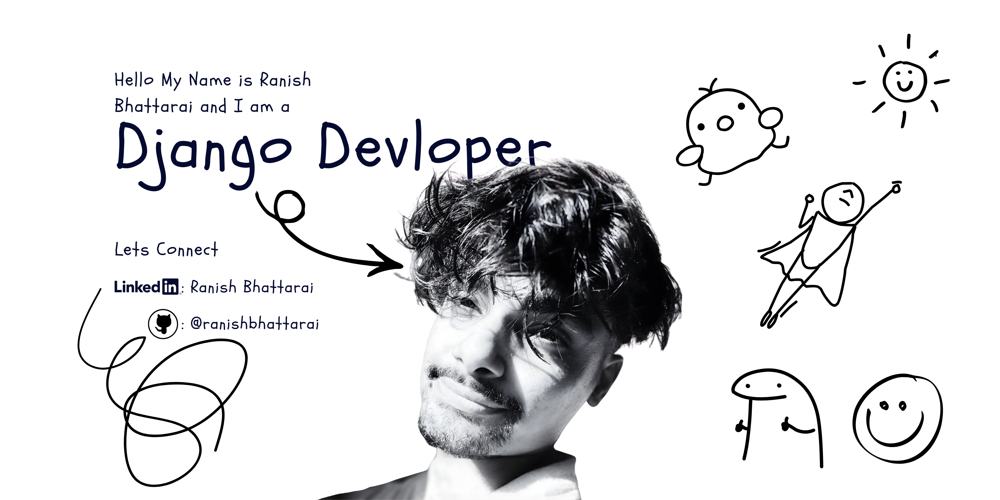

  

---

## 🚀 Backend Engineer | Django & DRF

Building scalable backend systems with clean architecture, service-layer design, and production-ready APIs.

---

## 💫 About Me

- 💻 Backend-focused developer specializing in **Django & Django REST Framework**
- 🧠 Strong interest in **system design, database modeling, and API architecture**
- 🏗️ Currently building real-world systems like:
  - Restaurant Management System (RMS)
  - HRMS module with modular architecture
- ⚡ Focused on writing **clean, maintainable, and scalable code**

---

## 🧠 Current Focus

- Designing **modular DRF architectures (service layer pattern)**
- Optimizing **database queries & performance**
- Building **production-ready backend systems**
- Moving toward **full-stack (React / Next.js)**

---

## 💻 Tech Stack

### 🚀 Backend

### 🎨 Frontend

### 🗄️ Database / Tools

---

## 📊 GitHub Analytics

  
  

  

  

---

## 🐍 Contribution Snake

<picture>
  <source media="(prefers-color-scheme: dark)"
    srcset="https://raw.githubusercontent.com/ranishbhattarai/ranishbhattarai/output/github-contribution-grid-snake-dark.svg" />
  <source media="(prefers-color-scheme: light)"
    srcset="https://raw.githubusercontent.com/ranishbhattarai/ranishbhattarai/output/github-contribution-grid-snake.svg" />
  
</picture>

---

## 🤝 Let’s Connect

- 📫 Email: ranishbhattarai4@gmail.com  
- 💼 LinkedIn: https://www.linkedin.com/in/ranish-bhattarai-53a27a242/

---

  Thanks for visiting my profile ✨

